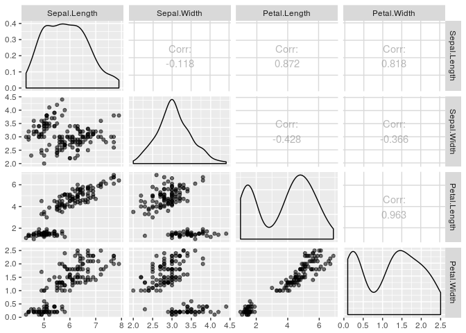
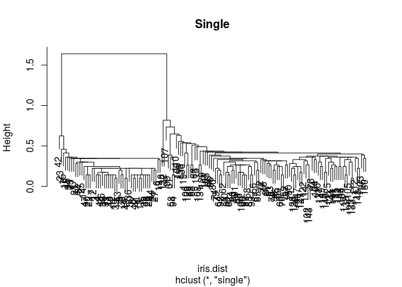
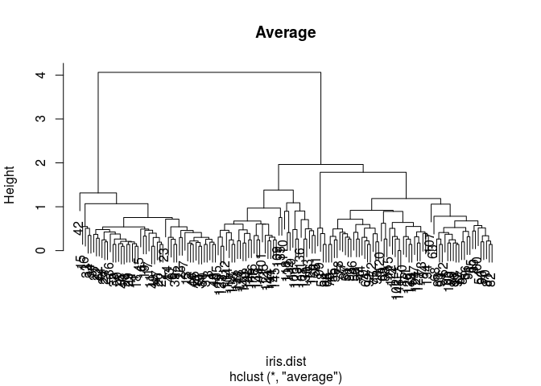
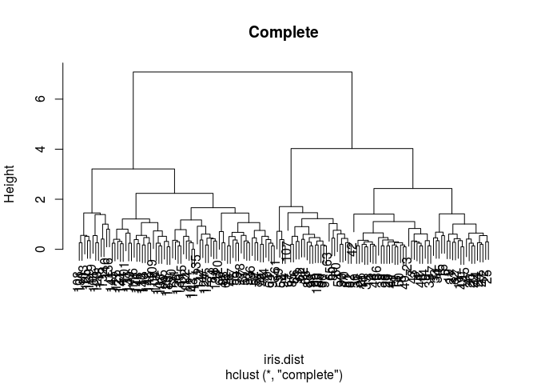

home10
================

``` r
#a)
require("MASS")
```

    ## Loading required package: MASS

``` r
require("ggplot2")
```

    ## Loading required package: ggplot2

``` r
require("GGally")
```

    ## Loading required package: GGally

    ## Warning: replacing previous import by 'utils::capture.output' when loading
    ## 'GGally'

    ## Warning: replacing previous import by 'utils::head' when loading 'GGally'

    ## Warning: replacing previous import by 'utils::installed.packages' when
    ## loading 'GGally'

    ## Warning: replacing previous import by 'utils::str' when loading 'GGally'

``` r
require("gridExtra")
```

    ## Loading required package: gridExtra

``` r
data("iris")
# View(iris)

n <- nrow(iris)
labs <- rep(NA, n)
labs[iris$Species == "setosa"] <- 1
labs[iris$Species == "versicolor"] <- 2
labs[iris$Species == "virginica"] <- 3


p <- ggpairs(data = iris,
             columns = 1:4,
             aes(alpha = 0.4))
p
```



``` r
#b)
iris.dist <- dist(iris[, -5], method = "euclidean")
rounded <- round(iris.dist, 1)
View(as.matrix(rounded))

#d)
iris.min <- hclust(iris.dist, method = "single")

#e)
plot(iris.min, main = "Single")
```



``` r
#f)
iris.ave <- hclust(iris.dist, method = "average")
plot(iris.ave, main = "Average")
```



``` r
iris.max <- hclust(iris.dist, method = "complete")
plot(iris.max, main = "Complete")
```



``` r
#g)
Minp <- cutree(iris.min, k = 3)
Minp
```

    ##   [1] 1 1 1 1 1 1 1 1 1 1 1 1 1 1 1 1 1 1 1 1 1 1 1 1 1 1 1 1 1 1 1 1 1 1 1
    ##  [36] 1 1 1 1 1 1 1 1 1 1 1 1 1 1 1 2 2 2 2 2 2 2 2 2 2 2 2 2 2 2 2 2 2 2 2
    ##  [71] 2 2 2 2 2 2 2 2 2 2 2 2 2 2 2 2 2 2 2 2 2 2 2 2 2 2 2 2 2 2 2 2 2 2 2
    ## [106] 2 2 2 2 2 2 2 2 2 2 2 2 3 2 2 2 2 2 2 2 2 2 2 2 2 2 3 2 2 2 2 2 2 2 2
    ## [141] 2 2 2 2 2 2 2 2 2 2

``` r
sum(Minp == labs) / n # accuracy rate
```

    ## [1] 0.68

``` r
Maxp <- cutree(iris.max, k = 3)
Maxp   
```

    ##   [1] 1 1 1 1 1 1 1 1 1 1 1 1 1 1 1 1 1 1 1 1 1 1 1 1 1 1 1 1 1 1 1 1 1 1 1
    ##  [36] 1 1 1 1 1 1 1 1 1 1 1 1 1 1 1 2 2 2 3 2 3 2 3 2 3 3 3 3 2 3 2 3 3 2 3
    ##  [71] 2 3 2 2 2 2 2 2 2 3 3 3 3 2 3 2 2 2 3 3 3 2 3 3 3 3 3 2 3 3 2 2 2 2 2
    ## [106] 2 3 2 2 2 2 2 2 2 2 2 2 2 2 2 2 2 2 2 2 2 2 2 2 2 2 2 2 2 2 2 2 2 2 2
    ## [141] 2 2 2 2 2 2 2 2 2 2

``` r
sum(Maxp == labs) / n
```

    ## [1] 0.4933333

``` r
Avep <- cutree(iris.ave, k = 3)
Avep
```

    ##   [1] 1 1 1 1 1 1 1 1 1 1 1 1 1 1 1 1 1 1 1 1 1 1 1 1 1 1 1 1 1 1 1 1 1 1 1
    ##  [36] 1 1 1 1 1 1 1 1 1 1 1 1 1 1 1 2 2 2 2 2 2 2 2 2 2 2 2 2 2 2 2 2 2 2 2
    ##  [71] 2 2 2 2 2 2 2 2 2 2 2 2 2 2 2 2 2 2 2 2 2 2 2 2 2 2 2 2 2 2 3 2 3 3 3
    ## [106] 3 2 3 3 3 3 3 3 2 2 3 3 3 3 2 3 2 3 2 3 3 2 2 3 3 3 3 3 2 3 3 3 3 2 3
    ## [141] 3 3 2 3 3 3 2 3 3 2

``` r
sum(Avep == labs) / n # highest
```

    ## [1] 0.9066667
