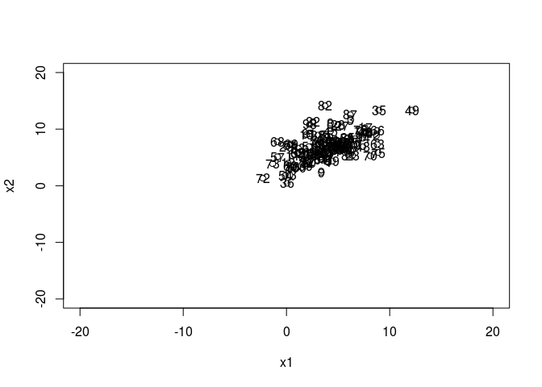

home2
================

Problem Description
-------------------

Simulate 100 observations from bivariate normal distribution.

Q1
--

Plot the data. Label the data points with the corresponding observation num- ber.

``` r
library(mvtnorm)
sigma <- matrix(c(10, 6, 6, 8), ncol = 2, byrow = T)
mu <- c(4,7)
set.seed(123)
x <- rmvnorm(100, mean = mu, sigma = sigma)
x_frame <- data.frame(x)
plot(x_frame, xlab = "x1", ylab = "x2", xlim = c(-20, 20), ylim = c(-20, 20))
text(x_frame$X1, x_frame$X2,labels = rownames(x_frame))
```



Q2
--

Perform the covariance based PCA transformation to the data set.

``` r
x.pca <- princomp(x_frame, cor = F, scale = F) # covariance based princomp
names(x.pca)
```

    ## [1] "sdev"     "loadings" "center"   "scale"    "n.obs"    "scores"  
    ## [7] "call"

Q3
--

Plot the score matrix. Use the same scale as in (a) and label the data points with the corresponding observation number.

``` r
pca_frame <- data.frame(x.pca$scores)
plot(pca_frame, xlab = "Comp1", ylab = "Comp2", xlim = c(-20, 20), ylim = c(-20, 20))
text(pca_frame$Comp.1, pca_frame$Comp.2,labels = rownames(pca_frame))
```


Q4
--

Calculate the G and Y matrices without using any existing PCA functions. Note that the function princomp scales the covariance matrix with 1/n (in- stead of the usual 1/(n − 1)).

``` r
my_cov <- function(x){
  meanx <- colMeans(x)
  centerx <- sweep(x,2,meanx,"-")
  cov_val <- (t(centerx)) %*% (centerx) / (dim(x)[1])
  return(cov_val)
}

x.cov <- my_cov(x)
x.cov.sig <- eigen(x.cov)
g <- x.cov.sig$vectors
#x.pca$loadings

#notice here, x - colMeans(x) is wrong
y <- sweep(x, 2, colMeans(x), '-') %*%g #y
#x.pca$scores
#the same as scale(x, x.pca$center, x.pca$scale)%*%x.pca$loadings
```

Q5
--

Plot the directions of the first and second principal component to the original data. The function arrows might be useful.

``` r
pca1 <- c(colMeans(x), colMeans(x) + t(g[,1])*10)
pca2 <- c(colMeans(x), colMeans(x) + t(g[,2])*5)
plot(x_frame, xlab = "x1", ylab = "x2", xlim = c(-20, 20), ylim = c(-20, 20))
arrows(pca1[1], pca1[2], pca1[3], pca1[4])
arrows(pca2[1], pca2[2], pca2[3], pca2[4])
```


