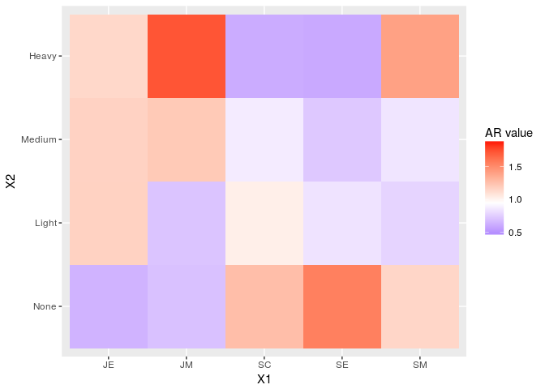

home5
================

Frequency Analysis
------------------

The data SMOKING1.txt contains a 2-dimensional frequency table, where the em- ployees of a firm have been categorized according to their position (5 categories: SM = Senior Managers, JM= Junior Managers, SE = Senior Employees, JE = Junior Employees, SC = Secretaries). Furthermore, the smoking of the employees have 4 categories (None, Light, Medium, Heavy).

Q1
--

Form the theoretical frequencies under independence.

``` r
tb <- read.table("data/SMOKING.txt", header = T, row.names = 1)
#dim(tb)
tb <- as.matrix(tb[-6,-5])
#View(tb)

v1 <- margin.table(tb,1)
v2 <- margin.table(tb,2)

V1 <- matrix(v1,ncol=1) 
V2 <- matrix(v2,nrow=1) 

E <- V1 %*% V2 /sum(tb)
E
```

    ##           [,1]      [,2]      [,3]      [,4]
    ## [1,]  3.476684  2.564767  3.533679  1.424870
    ## [2,]  5.689119  4.196891  5.782383  2.331606
    ## [3,] 16.119171 11.891192 16.383420  6.606218
    ## [4,] 27.813472 20.518135 28.269430 11.398964
    ## [5,]  7.901554  5.829016  8.031088  3.238342

Q2
--

Calculate the attraction repulsion matrix.

    ##         None     Light    Medium     Heavy
    ## SM 1.1505216 0.7797980 0.8489736 1.4036364
    ## JM 0.7030965 0.7148148 1.2105735 1.7155556
    ## SE 1.5509482 0.8409586 0.7324478 0.6054902
    ## JE 0.6471684 1.1696970 1.1673387 1.1404545
    ## SC 1.2655738 1.0293333 0.8716129 0.6176000

Q3
--

Is smoking more frequent among a specific group in this company?


