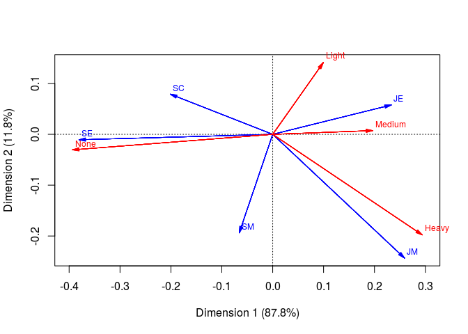
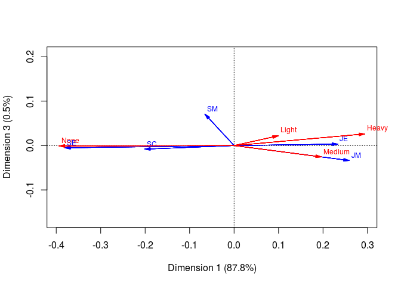
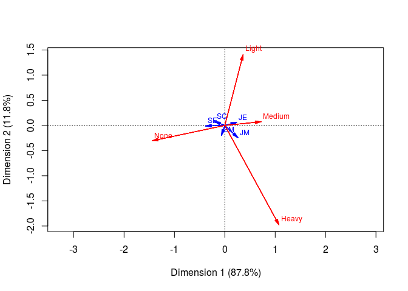

Bivariate Correspondence Analysis
================

Bivariate Correspondence Analysis
---------------------------------

The data SMOKING1.txt contains a two-dimensional frequency table, where the employees of a company have been categorized according to their position (5 cat- egories: SM = Senior Managers, JM= Junior Managers, SE = Senior Employees, JE = Junior Employees, SC = Secretaries). The smoking of the employees have 4 categories (None, Light, Medium, Heavy).

Q1
--

Form the row and column profiles.

``` r
smok <- read.table("data/SMOKING.txt", header = TRUE, row.names = 1)
smok <- smok[-dim(smok)[1], -dim(smok)[2]] #remove the total col/row
# View(smok)
D <- as.matrix(smok)
prop.table(D, 1) # row profiles
```

    ##         None     Light    Medium      Heavy
    ## SM 0.3636364 0.1818182 0.2727273 0.18181818
    ## JM 0.2222222 0.1666667 0.3888889 0.22222222
    ## SE 0.4901961 0.1960784 0.2352941 0.07843137
    ## JE 0.2045455 0.2727273 0.3750000 0.14772727
    ## SC 0.4000000 0.2400000 0.2800000 0.08000000

``` r
prop.table(D, 2) # col profiles
```

    ##          None      Light    Medium Heavy
    ## SM 0.06557377 0.04444444 0.0483871  0.08
    ## JM 0.06557377 0.06666667 0.1129032  0.16
    ## SE 0.40983607 0.22222222 0.1935484  0.16
    ## JE 0.29508197 0.53333333 0.5322581  0.52
    ## SC 0.16393443 0.13333333 0.1129032  0.08

``` r
row.sum <- apply(smok, 1, sum)
row.profile <- sweep(smok, 1, row.sum, "/")

col.sum <- apply(smok, 2, sum)
col.profile <- sweep(smok, 2, col.sum, "/")
```

chi-square test
---------------

``` r
n <- sum(smok)
v1 <- matrix(colSums(smok), nrow = 1)
v2 <- matrix(rowSums(smok), ncol = 1)
E <- v2 %*% v1 / n # theoretical frequencies under independence
chi <- sum((D - E)^2 / E) # chi-square statistics
I <- dim(D)[1]
J <- dim(D)[2]
pchisq(chi, df = ((I-1)*(J-1)), lower.tail = F) # p-value
```

    ## [1] 0.1718348

``` r
chisq.test(smok)
```

    ## Warning in chisq.test(smok): Chi-squared approximation may be incorrect

    ## 
    ##  Pearson's Chi-squared test
    ## 
    ## data:  smok
    ## X-squared = 16.442, df = 12, p-value = 0.1718

Analysis ca
-----------

``` r
library(ca)
n <- sum(smok)
smok.ca <- ca(smok)
names(smok.ca)
```

    ##  [1] "sv"         "nd"         "rownames"   "rowmass"    "rowdist"   
    ##  [6] "rowinertia" "rowcoord"   "rowsup"     "colnames"   "colmass"   
    ## [11] "coldist"    "colinertia" "colcoord"   "colsup"     "N"         
    ## [16] "call"

``` r
smok.ca$sv # sqrt(lambda_i)
```

    ## [1] 0.27342111 0.10008587 0.02033652

``` r
smok.ca$rowdist # Row chi-square distances to centroid
```

    ## [1] 0.2165590 0.3569210 0.3807790 0.2400247 0.2161692

``` r
smok.ca$rownames
```

    ## [1] "SM" "JM" "SE" "JE" "SC"

``` r
smok.ca$coldist
```

    ## [1] 0.3944897 0.1739958 0.1981274 0.3551093

``` r
smok.ca$colnames
```

    ## [1] "None"   "Light"  "Medium" "Heavy"

``` r
smok.ca$rowcoord # scaled coordinates phi_ji/sqrt(lambda_i)
```

    ##          Dim1       Dim2       Dim3
    ## SM -0.2405388 -1.9357079  3.4903231
    ## JM  0.9471047 -2.4309584 -1.6573725
    ## SE -1.3919733 -0.1065076 -0.2535221
    ## JE  0.8519895  0.5769437  0.1625337
    ## SC -0.7354557  0.7884353 -0.3973677

``` r
smok.ca$colcoord
```

    ##              Dim1        Dim2        Dim3
    ## None   -1.4384714 -0.30465911 -0.04378737
    ## Light   0.3637463  1.40943267  1.08170100
    ## Medium  0.7180168  0.07352795 -1.26172451
    ## Heavy   1.0744451 -1.97595989  1.28885615

``` r
smok.ca$rowcoord[1,]*smok.ca$sv*1000 # coordinates in the summary
```

    ##       Dim1       Dim2       Dim3 
    ##  -65.76838 -193.73700   70.98103

``` r
sqrt(sum((smok.ca$rowcoord[1,]*smok.ca$sv)^2)) # distance from the center for SM
```

    ## [1] 0.216559

``` r
#innertia is the chi squared statistic divided by n
smok.ca$rowinertia 
```

    ## [1] 0.002672932 0.011881177 0.038314129 0.026268627 0.006052995

``` r
smok.ca$colinertia 
```

    ## [1] 0.049186258 0.007058828 0.012610242 0.016334533

``` r
sum(smok.ca$rowinertia)
```

    ## [1] 0.08518986

``` r
sum(smok.ca$colinertia)
```

    ## [1] 0.08518986

``` r
sum(smok.ca$sv^2)
```

    ## [1] 0.08518986

``` r
chi/n
```

    ## [1] 0.08518986

``` r
#take an example
sum((smok[1,] - E[1,])^2/E[1,])/n
```

    ## [1] 0.002672932

``` r
smok.ca$rowinertia[1]
```

    ## [1] 0.002672932

``` r
#proportional values, the same as in the summary
smok.ca$rowinertia/sum(smok.ca$sv^2) * 1000
```

    ## [1]  31.37618 139.46703 449.74987 308.35392  71.05300

``` r
# relative marginal frequencies of the original table
smok.ca$rowmass
```

    ## [1] 0.05699482 0.09326425 0.26424870 0.45595855 0.12953368

``` r
rowSums(smok/n)
```

    ##         SM         JM         SE         JE         SC 
    ## 0.05699482 0.09326425 0.26424870 0.45595855 0.12953368

``` r
margin.table(as.matrix(smok), 1)/sum(smok)
```

    ##         SM         JM         SE         JE         SC 
    ## 0.05699482 0.09326425 0.26424870 0.45595855 0.12953368

``` r
smok.ca$colmass
```

    ## [1] 0.3160622 0.2331606 0.3212435 0.1295337

``` r
colSums(smok/n)
```

    ##      None     Light    Medium     Heavy 
    ## 0.3160622 0.2331606 0.3212435 0.1295337

``` r
# the original table
smok.ca$N
```

    ##      [,1] [,2] [,3] [,4]
    ## [1,]    4    2    3    2
    ## [2,]    4    3    7    4
    ## [3,]   25   10   12    4
    ## [4,]   18   24   33   13
    ## [5,]   10    6    7    2

``` r
# ctr, the contribution in forming that ca-component, SM
margins <- smok.ca$rowmass
margins[1]*smok.ca$rowcoord[1,2]^2 # ctr
```

    ## [1] 0.2135576

``` r
# quality of representation --- Squared correlation
# Squared correlation of SM, quality of representation
d1 = (smok.ca$rowcoord[1,]*smok.ca$sv)^2 # sum(phi_ij^2)
d1/sum(d1)
```

    ##       Dim1       Dim2       Dim3 
    ## 0.09223203 0.80033639 0.10743158

Q2
--

How much of the variation is explained by the combination of components 1 and 3. Give the answer in percentages relative to the total variation.

``` r
library(ca)
smok.ca <- ca(smok)
smok.ca$sv^2/sum(smok.ca$sv^2)
```

    ## [1] 0.877558731 0.117586535 0.004854734

``` r
summary(smok.ca)
```

    ## 
    ## Principal inertias (eigenvalues):
    ## 
    ##  dim    value      %   cum%   scree plot               
    ##  1      0.074759  87.8  87.8  **********************   
    ##  2      0.010017  11.8  99.5  ***                      
    ##  3      0.000414   0.5 100.0                           
    ##         -------- -----                                 
    ##  Total: 0.085190 100.0                                 
    ## 
    ## 
    ## Rows:
    ##     name   mass  qlt  inr    k=1 cor ctr    k=2 cor ctr  
    ## 1 |   SM |   57  893   31 |  -66  92   3 | -194 800 214 |
    ## 2 |   JM |   93  991  139 |  259 526  84 | -243 465 551 |
    ## 3 |   SE |  264 1000  450 | -381 999 512 |  -11   1   3 |
    ## 4 |   JE |  456 1000  308 |  233 942 331 |   58  58 152 |
    ## 5 |   SC |  130  999   71 | -201 865  70 |   79 133  81 |
    ## 
    ## Columns:
    ##     name   mass  qlt  inr    k=1 cor ctr    k=2 cor ctr  
    ## 1 | None |  316 1000  577 | -393 994 654 |  -30   6  29 |
    ## 2 | Lght |  233  984   83 |   99 327  31 |  141 657 463 |
    ## 3 | Medm |  321  983  148 |  196 982 166 |    7   1   2 |
    ## 4 | Hevy |  130  995  192 |  294 684 150 | -198 310 506 |

Q3
--

Produce the BCA graph with respect to the first two components.

``` r
plot(smok.ca, arrows=c(TRUE, T), map = "symmetric")
```



``` r
plot(smok.ca, arrows=c(TRUE, T), map = "symmetric", dim = c(1,3))
```



``` r
plot(smok.ca, arrows = c(T, T), map = "rowprincipal")
```



Q4
--

How much of the variation of the modality Heavy is explained by the first two components? How much of the variation of the modality Medium is explained by the first two components? Give the answers in percentages relative to the total variation. Hint: use the quality of representation.

``` r
# the variation of the modality Heavy explained by the first two components
h <- (smok.ca$colcoord[4,]*smok.ca$sv)^2
sum(h[c(1,2)])/sum(h)
```

    ## [1] 0.994552

``` r
# the variation of the modality Medium explained by the first two components
m <- (smok.ca$colcoord[3,]*smok.ca$sv)^2
sum(m[c(1,2)])/sum(m)
```

    ## [1] 0.9832277
