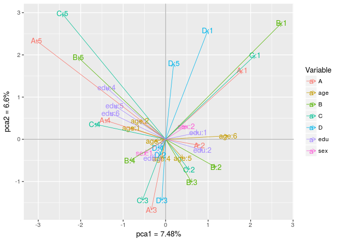

home7
================

Multiple Correspondence Analysis
--------------------------------

Find a combination of two MCA components that explain as much of the variation as possible. What is the combination and how much of the total variation is explained by these two components?

``` r
library("ca")
library("ggplot2")
tb <- read.table("data/WG93_full.txt", header = T, row.names = 1)
head(tb)
```

    ##   A B C D sex age edu
    ## 1 2 3 4 3   2   2   3
    ## 2 3 4 2 3   1   3   4
    ## 3 2 3 2 4   2   3   2
    ## 4 2 2 2 2   1   2   3
    ## 5 3 3 3 3   1   5   2
    ## 6 3 4 4 5   1   3   2

``` r
# View(tb)

# univariate analysis
par(mfrow = c(3,3))
for(i in 1:dim(tb)[2]){
  tmp <- table(tb[,i])
  lab <- round(100*tmp/sum(tmp),1)
  pielabels <- paste(lab,"%",sep="")
  cols <- c("black","grey","green","red", "yellow", "brown")
  title <- names(tb)[i]
  pie(tmp, main=title,col=cols,labels=pielabels,cex=0.8)
  
  legend("topleft",names(lab),fill=cols,horiz=F,cex=0.5)
}


# multivariate analysis
tb.mca <- mjca(tb, lambda = "indicator")
names(tb.mca)
```

    ##  [1] "sv"         "lambda"     "inertia.e"  "inertia.t"  "inertia.et"
    ##  [6] "levelnames" "factors"    "levels.n"   "nd"         "nd.max"    
    ## [11] "rownames"   "rowmass"    "rowdist"    "rowinertia" "rowcoord"  
    ## [16] "rowpcoord"  "rowctr"     "rowcor"     "colnames"   "colmass"   
    ## [21] "coldist"    "colinertia" "colcoord"   "colpcoord"  "colctr"    
    ## [26] "colcor"     "colsup"     "subsetcol"  "Burt"       "Burt.upd"  
    ## [31] "subinertia" "JCA.iter"   "indmat"     "call"

``` r
summary(tb.mca)
```

    ## 
    ## Principal inertias (eigenvalues):
    ## 
    ##  dim    value      %   cum%   scree plot               
    ##  1      0.288631   7.5   7.5  **                       
    ##  2      0.254739   6.6  14.1  **                       
    ##  3      0.208293   5.4  19.5  *                        
    ##  4      0.197388   5.1  24.6  *                        
    ##  5      0.182529   4.7  29.3  *                        
    ##  6      0.167771   4.3  33.7  *                        
    ##  7      0.165139   4.3  38.0  *                        
    ##  8      0.159631   4.1  42.1  *                        
    ##  9      0.157281   4.1  46.2  *                        
    ##  10     0.150905   3.9  50.1  *                        
    ##  11     0.147490   3.8  53.9  *                        
    ##  12     0.143872   3.7  57.7  *                        
    ##  13     0.138837   3.6  61.3  *                        
    ##  14     0.133382   3.5  64.7  *                        
    ##  15     0.129482   3.4  68.1  *                        
    ##  16     0.127166   3.3  71.4  *                        
    ##  17     0.126533   3.3  74.6  *                        
    ##  18     0.122010   3.2  77.8  *                        
    ##  19     0.116608   3.0  80.8  *                        
    ##  20     0.111584   2.9  83.7  *                        
    ##  21     0.106602   2.8  86.5  *                        
    ##  22     0.097587   2.5  89.0  *                        
    ##  23     0.094197   2.4  91.5  *                        
    ##  24     0.092488   2.4  93.9  *                        
    ##  25     0.085250   2.2  96.1  *                        
    ##  26     0.082464   2.1  98.2  *                        
    ##  27     0.069284   1.8 100.0                           
    ##         -------- -----                                 
    ##  Total: 3.857143 100.0                                 
    ## 
    ## 
    ## Columns:
    ##       name   mass  qlt  inr     k=1 cor ctr    k=2 cor ctr  
    ## 1  |   A:1 |   20  255   33 |   967 148  63 |  823 107  52 |
    ## 2  |   A:2 |   53  109   23 |   426 106  33 |  -71   3   1 |
    ## 3  |   A:3 |   33  228   29 |  -180  10   4 | -844 218  94 |
    ## 4  |   A:4 |   29  165   30 |  -769 152  60 |  228  13   6 |
    ## 5  |   A:5 |    8  238   37 | -1639 157  73 | 1183  82  43 |
    ## 6  |   B:1 |   12  362   38 |  1466 191  87 | 1390 172  88 |
    ## 7  |   B:2 |   29  129   29 |   635 101  40 | -335  28  13 |
    ## 8  |   B:3 |   34  115   27 |   330  34  13 | -515  82  35 |
    ## 9  |   B:4 |   46  129   25 |  -454  98  33 | -256  31  12 |
    ## 10 |   B:5 |   23  417   36 | -1105 234  97 |  979 184  86 |
    ## 11 |   C:1 |   25  484   36 |  1131 270 110 | 1005 213  99 |
    ## 12 |   C:2 |   52  125   23 |   293  49  15 | -365  76  27 |
    ## 13 |   C:3 |   32  181   29 |  -295  25  10 | -729 156  67 |
    ## 14 |   C:4 |   25  181   32 |  -899 174  71 |  181   7   3 |
    ## 15 |   C:5 |    9  252   37 | -1309 109  51 | 1504 144  76 |
    ## 16 |   D:1 |   10  146   34 |   534  21  10 | 1301 125  65 |
    ## 17 |   D:2 |   38   14   26 |   -67   2   1 | -187  13   5 |
    ## 18 |   D:3 |   33  162   29 |   -48   1   0 | -731 162  70 |
    ## 19 |   D:4 |   37    7   26 |   -98   3   1 | -105   4   2 |
    ## 20 |   D:5 |   25  174   30 |   102   2   1 |  906 172  80 |
    ## 21 | sex:1 |   70   95   18 |  -268  69  17 | -163  26   7 |
    ## 22 | sex:2 |   73   95   18 |   258  69  17 |  157  26   7 |
    ## 23 | age:1 |   15   25   33 |  -437  22  10 |  138   2   1 |
    ## 24 | age:2 |   34   50   27 |  -330  35  13 |  220  15   7 |
    ## 25 | age:3 |   26    4   28 |  -136   4   2 |  -21   0   0 |
    ## 26 | age:4 |   24   11   28 |   -56   1   0 | -230  11   5 |
    ## 27 | age:5 |   20   16   30 |   217   8   3 | -225   8   4 |
    ## 28 | age:6 |   23  121   31 |   787 121  50 |   43   0   0 |
    ## 29 | edu:1 |    6    8   34 |   414   8   4 |   83   0   0 |
    ## 30 | edu:2 |   62  180   22 |   467 167  47 | -131  13   4 |
    ## 31 | edu:3 |   40   30   25 |  -170  11   4 | -221  19   8 |
    ## 32 | edu:4 |   15  114   34 |  -750  68  30 |  618  46  23 |
    ## 33 | edu:5 |    8   34   32 |  -644  25  12 |  403  10   5 |
    ## 34 | edu:6 |   11   51   32 |  -700  43  19 |  315   9   4 |

``` r
# first two principle components
(tb.mca$sv[1]^2 + tb.mca$sv[2]^2) / sum(tb.mca$sv^2)
```

    ## [1] 0.1408736


Produce the MCA graph with respect to the components chosen in (a).

``` r
# plot
# data frame for ggplot
tb_mca_df = data.frame(tb.mca$colcoord, Variable = rep(names(tb.mca$levels.n), tb.mca$levels.n))
rownames(tb_mca_df) = tb.mca$levelnames

# plot
xx = round(tb.mca$sv[1]^2/sum(tb.mca$sv^2)*100, 2)
yy = round(tb.mca$sv[2]^2/sum(tb.mca$sv^2)*100, 2)
ggplot(data = tb_mca_df, 
       aes(x = X1, y = X2, label = rownames(tb_mca_df))) +
  geom_hline(yintercept = 0, colour = "gray70") +
  geom_vline(xintercept = 0, colour = "gray70") +
  geom_text(aes(colour = Variable)) +
  geom_segment(mapping=aes(x=0, y=0, xend=X1, yend=X2, colour = Variable), arrow=arrow(length=unit(0.2,"cm")), size=0.3) + 
  labs(x = paste("pca1 = ", xx,"%",sep=""), y = paste("pca2 = ", yy,"%",sep="")) 
```



What is the relationship between education and strong opinions (strongly agree/strongly disagree) in this data set? Justify!

``` r
# question 3
questions = c("A", "B", "C", "D")
par(mfrow=c(2,2))
for(i in 1 : length(questions)){
  tbb <- tb[, which(names(tb) == "edu" | names(tb) == questions[i])]
  tmp <- table(tbb)
  tmp.ca <- ca(tmp)
  plot(tmp.ca, arrows = c(T, T), what = c("all", "all"))
  legend("topleft", names(tbb), fill = c("blue", "red"), horiz=F, cex=0.5)
}
```


