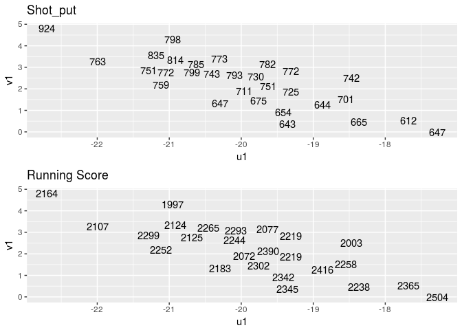
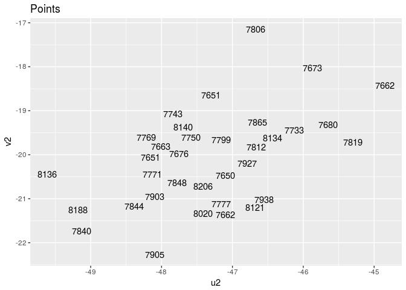

ex8
================

``` r
library(ggplot2)
library(gridExtra)
decathlon <- read.table("data/DECATHLON.txt", header = T, row.names = 1)
de <- decathlon[, -1]

X <- as.matrix(de[, c(11, 12)])  # "Height" "Weight"
Y <- as.matrix(de[, c(-11, -12)])  # R100m Long_jump Shot_put High_jump R400m Hurdles Discus_throw Pole_vault Javelin R1500m
XY <- cbind(X, Y)

# (a)
# compute sample canonical vectors with corrected scaling
R <- cov(XY)
R11 <- cov(X)
R22 <- cov(Y)
R21 <- cov(Y, X)
R12 <- cov(X, Y)
R11.inv <- solve(R11)
R22.inv <- solve(R22)

#Non-zero eigenvalues of M1 and M2 are the same
M1 <- R11.inv %*% R12 %*% R22.inv %*% R21
M2 <- R22.inv %*% R21 %*% R11.inv %*% R12


va1 <- eigen(M1)$vectors[,1]
va2 <- eigen(M1)$vectors[,2]

vb1 <- eigen(M2)$vectors[,1]
vb2 <- eigen(M2)$vectors[,2]

#Remove the "ghost" imaginary parts
vb1=as.numeric(vb1)
vb2=as.numeric(vb2)

# Correct scaling. We scale with the standard deviation of the scores
a1 <- va1/sqrt(va1%*%R11%*%va1)
a2 <- va2/sqrt(va2%*%R11%*%va2)
b1 <- vb1/sqrt(vb1%*%R22%*%vb1)
b2 <- vb2/sqrt(vb2%*%R22%*%vb2)

# Another approach (maybe more intuitive) to get the scaling right
eta1 = X %*% va1  #Scores on the first canonical correlation variable related to X
a1 = va1/sqrt(var(eta1))

var(eta1)-va1%*%R11%*%va1
```

    ##               [,1]
    ## [1,] -2.842171e-14

``` r
# The condition for correct scaling is that the following are 1
a1 %*% R11 %*% a1 #Note that here R automatically transposes the first vector
```

    ##      [,1]
    ## [1,]    1

``` r
a2 %*% R11 %*% a2
```

    ##      [,1]
    ## [1,]    1

``` r
b1 %*% R22 %*% b1
```

    ##      [,1]
    ## [1,]    1

``` r
b2 %*% R22 %*% b2
```

    ##      [,1]
    ## [1,]    1

``` r
# Note that the following are 0
a1 %*% R11 %*% a2 
```

    ##              [,1]
    ## [1,] 2.220446e-16

``` r
b1 %*% R22 %*% b2
```

    ##               [,1]
    ## [1,] -7.771561e-16

``` r
# (b)
# Score vectors:
eta1 <- X%*%a1
eta2 <- X%*%a2
fii1 <- Y%*%b1
fii2 <- Y%*%b2

# sample canonical vectors scaled such that the score vectors have variance 1,
# this scaling makes them unique up to sign

var(eta1)
```

    ##      [,1]
    ## [1,]    1

``` r
var(eta2)
```

    ##      [,1]
    ## [1,]    1

``` r
var(fii1)
```

    ##      [,1]
    ## [1,]    1

``` r
var(fii2)
```

    ##      [,1]
    ## [1,]    1

``` r
# Matrix of the canonical correlations
round(cor(cbind(eta1,eta2,fii1,fii2)),2)
```

    ##       [,1] [,2]  [,3] [,4]
    ## [1,]  1.00 0.00 -0.78 0.00
    ## [2,]  0.00 1.00  0.00 0.49
    ## [3,] -0.78 0.00  1.00 0.00
    ## [4,]  0.00 0.49  0.00 1.00

``` r
#canonical correlations
# r1 = 0.98
# r2 = |-0.91| = 0.91
# The relationship between both pairs seems to be quite strong.

# Note that the canonical correlations are also the square roots of the non-zero
# eigenvalues of M1,M2

round(sqrt(eigen(M1)$values),2)
```

    ## [1] 0.78 0.49

``` r
# (c)
names(de[, c(which(b1<0))])
```

    ## [1] "R100m"      "Long_jump"  "High_jump"  "R400m"      "Pole_vault"
    ## [6] "Javelin"    "R1500m"

``` r
names(de[, c(which(b1>0))])
```

    ## [1] "Shot_put"     "Hurdles"      "Discus_throw"

``` r
pt1 = data.frame(eta1, fii1)
g1 <- ggplot(pt1, aes(x = eta1, y = fii1)) +
  geom_text(aes(label = decathlon$Shot_put), check_overlap = T) + 
  xlab("u1") +
  ylab("v1") + 
  ggtitle("Shot_put")

g2 <- ggplot(pt1, aes(x = eta1, y = fii1)) +
  geom_text(aes(label = (decathlon$R100m + decathlon$R400m + decathlon$R1500m)), check_overlap = T) + 
  xlab("u1") +
  ylab("v1") +
  ggtitle("Running Score")

grid.arrange(g1, g2, nrow = 2)
```



``` r
#(d)
names(de[, c(which(b2<0))])
```

    ## [1] "R400m"        "Hurdles"      "Discus_throw" "Javelin"     
    ## [5] "R1500m"

``` r
names(de[, c(which(b2>0))])
```

    ## [1] "R100m"      "Long_jump"  "Shot_put"   "High_jump"  "Pole_vault"

``` r
pt2 = data.frame(eta2, fii2)
ggplot(pt2, aes(x = eta2, y = fii2)) +
  geom_text(aes(label = decathlon$Points), check_overlap = T) +
  xlab("u2") +
  ylab("v2") +
  ggtitle("Points")
```



``` r
#(e)
```
