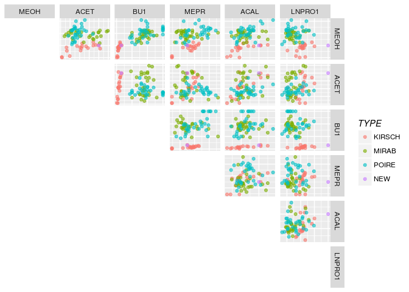
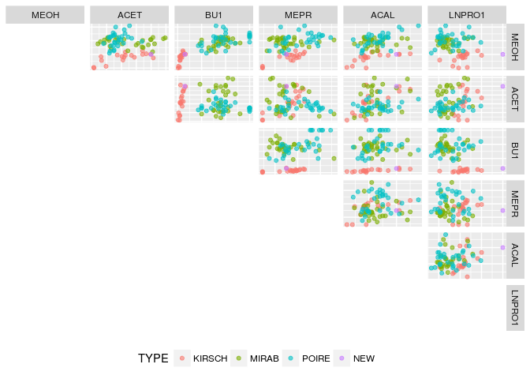
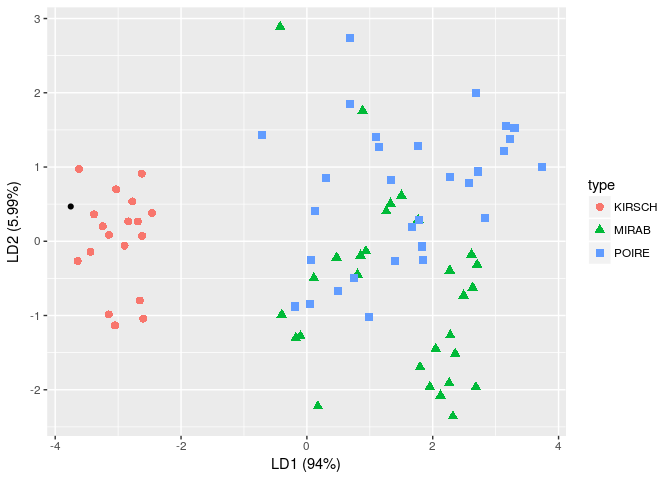

home9
================

``` r
require(MASS)
```

    ## Loading required package: MASS

``` r
require(MASS)
require(ggplot2)
```

    ## Loading required package: ggplot2

``` r
require(scales)
```

    ## Loading required package: scales

``` r
require(gridExtra)
```

    ## Loading required package: gridExtra

``` r
library(GGally)
```

    ## Warning: replacing previous import by 'utils::capture.output' when loading
    ## 'GGally'

    ## Warning: replacing previous import by 'utils::head' when loading 'GGally'

    ## Warning: replacing previous import by 'utils::installed.packages' when
    ## loading 'GGally'

    ## Warning: replacing previous import by 'utils::str' when loading 'GGally'

``` r
tb <- read.table("data/ALCOHOL.txt", header = T)

#(a)
#lda
lda <- lda(TYPE ~ ., data = tb, prior = c(1,1,1)/3)
a <- lda$scaling[,1] / norm(lda$scaling[,1], "2")

#(b)
# paiwise scatterplot
MEOH = 500
ACET = 400
BU1 = 3
MEPR = 30
ACAL = 20
LNPRO1 = 10
newdata <- data.frame(TYPE = "NEW", MEOH, ACET, BU1, MEPR, ACAL, LNPRO1)
alldata <- rbind(tb, newdata)
p <- ggpairs(data = alldata, 
             columns = 2:7,
             aes(colour = TYPE, alpha = 0.4, legend = TYPE),
             upper = list(continuous = wrap('points', alpha = 0.6), combo = "blank"),
             lower = list(continuous = 'blank', combo = "blank"),
             diag = list(continuous = 'blankDiag'),
             legend = c(3))
p + ggplot2::theme(legend.title = ggplot2::element_text(face = "italic"))
```



``` r
p + ggplot2:: theme(legend.position = "bottom")
```



``` r
#(c)
dispersion <- function(type, tb, newdata, a){
  t <- tb[tb$TYPE == type,]
  return(abs(sum((newdata[-1] - colMeans(t[, -1])) * a)))
}


kir <- dispersion("KIRSCH", tb, newdata, a)
mir <- dispersion("MIRAB", tb, newdata, a)
poi <- dispersion("POIRE", tb, newdata, a)


kir
```

    ## [1] 2.417979

``` r
mir
```

    ## [1] 16.48166

``` r
poi
```

    ## [1] 16.88299

``` r
prop.lda = lda$svd^2/sum(lda$svd^2)

plda <- predict(object = lda, newdata = tb[, -1])

pldata = data.frame(type = tb[,"TYPE"], lda = plda$x)


#new datapoint
newdata <- data.frame(MEOH, ACET, BU1, MEPR, ACAL, LNPRO1)
pnew <- predict(object = lda, newdata = newdata)
new_data_fram <- data.frame(pnew$x)

# lda after changing
ggplot(pldata) + 
  geom_point(aes(lda.LD1, lda.LD2, colour = type, shape = type), size = 2.5) + 
  geom_point(data = new_data_fram, aes(LD1, LD2)) +
  labs(x = paste("LD1 (", percent(prop.lda[1]), ")", sep=""),
       y = paste("LD2 (", percent(prop.lda[2]), ")", sep="")) 
```


